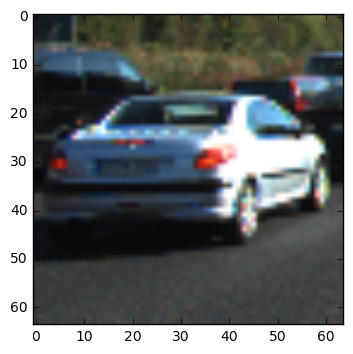
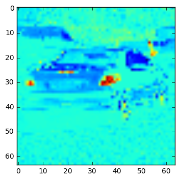
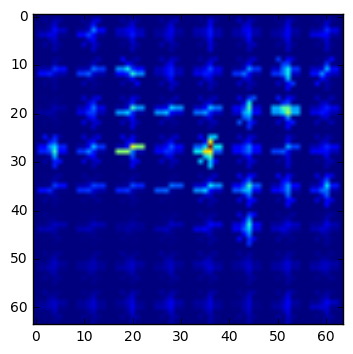
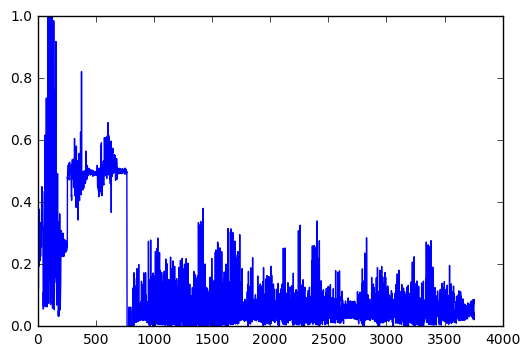
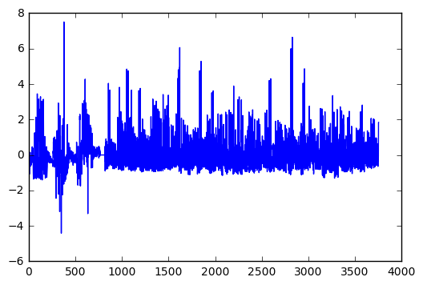
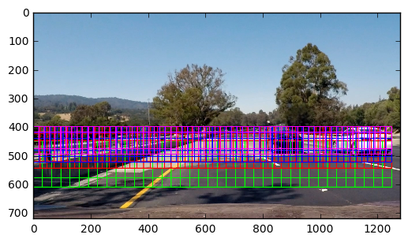
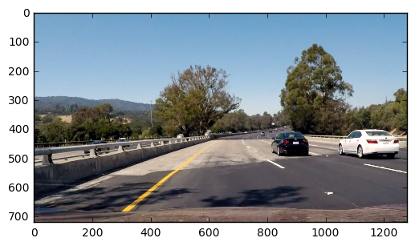
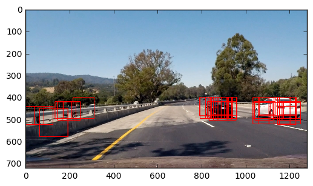
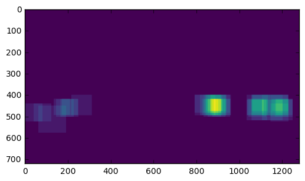
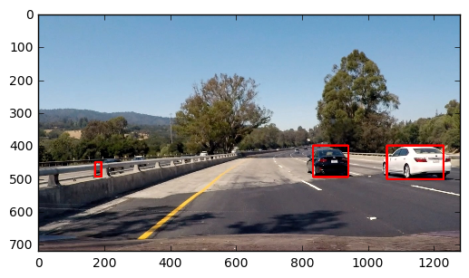

### Writeup / README

This project detects cars in a video stream. A car classifier is trained on a combination of image color historgrams, downsized raw image data, and histograms of oriented gradients (HOG) features. A siliding window is passed over a video frame at various scales and locates the cars.

### Histogram of Oriented Gradients (HOG)

#### 1. Features
The classfier used was a linear support vector machine with input feature vectors of color histograms and a 16x16x3 low resolution of the input image expressed as a single vector. Additionally, and most importantly three HOG feature vectors were used, of for each color in a YCrCb colorspace. Extracting the HOG features is done with a call to skimage.feature.hog. This call is wrapped by the get_hog_features function which was provided by udacity. 


 input
 single channel of car image
 HOG of single channel

#### 2. Hog Parameters:
Through trial and error I settled on hog paramters of orient = 5, pix_per_cell=8 and,cell_per_block=2. I selected orient as 5 to keep the respresntation fairly general, ie, not too specific for one car or another. Similarly the downsampled image size of 16x16 was used along with 16 bins for the color histogram.

#### 3. I used a linear SVM from scikit learn as my classifier. To train the svm I first partitoined my dataset into a train and test, and scaled the feature vectors using a scikit learn provided scaler.

 non scaled feature vector
 scaled feature vector

```python
X_scaler = StandardScaler().fit(X)
scaled_X = X_scaler.transform(X)

# Split up data into randomized training and test sets
X_train, X_test, y_train, y_test = train_test_split(scaled_X, Y, test_size=0.2, random_state=42)

svc = LinearSVC()

%time svc.fit(X_train, y_train)

print('Test Accuracy of SVC = ', round(svc.score(X_test, y_test), 4))
```

The accuracy on the test set was .983


### Sliding Window Search

#### 1. Slding WIndow:
A sliding window was passed over the frames to find the cars. Since the size of the car was unknown, various scales of windows were used.

After finding some candidate boxes in the image, a heatmap of them was generated to dedupe the boxes via a threshold.



```python
def get_car_boxes(img,svc,X_scaler, detail = 2):
    '''find cars using different scale sliding windows, returns list of bounding boxes'''
    scales = [2,1.5,1.3,1.2]
    ystarts = [450,400,400,400]
    ystops = [650,575,550,525]
    cell_steps = [detail,detail,detail,detail]
    
    boxes=[]
    for s, ys,ye,dx in zip(scales, ystarts,ystops,cell_steps):
        boxes += find_cars(img, ys, ye, s, svc, X_scaler,orient=5, pix_per_cell=8, cell_per_block=2, spatial_size=(16,16), hist_bins=16, cells_per_step=dx)
        
    return   boxes
```

#### 2. Example pipeline






Performance was a challenge. If there were not enough boxes the cars  may not be detected at the right locations or the bounding boxes might jump from frame to frame. I settled on many medium size boxes and few of the other sizes as a compromise but there is still lots of performance to be gained by a better search. 


### Video Implementation

#### 1 
Here's a [link to my video result](./project_video_result.mp4)


#### 2. False positives and overlap

To reduce false positives I rejected any region that only had a few detections via a threshold. To add smothness and make the classificiation more robust I kept track of the last 5 heatmaps (frames) and summed them prior to calculating my threshold. To increase the performance, I do a detailed search (more search windows) every 5 frames.

```python
global i
    
if i%10==0:
    d=1
    max_frames=5
else:
    d=2
    max_frames=5

car_boxes = get_car_boxes(img,svc,X_scaler, detail=d)

heat = build_heatmap(img,car_boxes)

heatmaps.append(heat)

full_heat = np.array(heatmaps[-1*max_frames:]).sum(axis=0)

#draw
new_frame = draw_boxes(img,extract_car_boxes(full_heat >= threshold), thick=3, color=(255,0,0))
```


### Discussion

Performance was the biggest problem. The sliding window approach, to find a tight bounding box, requires many windows at many scales. I only used three scales which leads to boxes that are sometimes too big and sometimes too small. A smart window search could be used. Perhaps large windows with a recursive subdivision search only on a highly scored match. To do this I would have needed to use something other than sklearn's SVC since it does not support returning match probabilties. A simple logistic classified with softmax output would have been easier to use. The pipeline will likey fail under dramatically different lighting conditions, struggles with occluded cars, and does not do well for vechicles on the horizon. Other approaches yet to be tried would be to just search the area nearest the last car location each frame, then every once in a while, search the entire image aggresively. In other words, track the cars once they are found instead of blindly looking for them each frame.

